# Pixel-NAS

**A fully automated, zero-subscription, End-to-End Encrypted (E2E) cloud backup pipeline built from a salvaged Android phone.**

Pixel-NAS transforms a legacy Google Pixel device into an always-on, invisible backup node. It silently syncs photos, videos, and files from your daily devices directly to Google Photos' infinite cloud storage—for free. No monthly subscriptions, no expensive NAS hardware, and zero manual maintenance.

*Currently managing an active archive of **100,826 photos and videos (~1.8–2.0 TB)** across multiple devices seamlessly, with archives going back to the 2007–2008 era and older.*
*(Calculated volume based on empirical data: A real-world sample of 5,722 items represented 91.74 GB [~16.03 MB/item] due to high-resolution phone media, RAW camera captures, and long 1080p/DJI video footage, projecting to ~1.6–2.0 TB for 100,000 items).* (as of August 19th 2026)

<div align="center">
  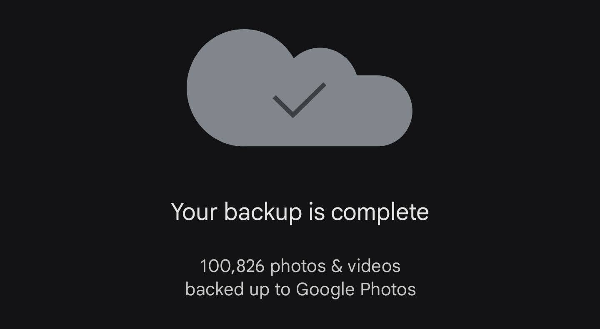
</div>
<br clear="all" />

---

## The Philosophy & Evolution

This project was born out of frustration. My digital memories were scattered across old phones, SD cards, and hard drives, creating an unmanageable mess that was vulnerable to hardware failure. While cloud storage solves this, paying a permanent monthly rent to keep memories alive felt flawed.

### 💸 Why Not Just Pay for Cloud Storage?

The obvious question: **Why build all of this instead of just paying ₹1,300/month for Google One 2TB?**

The answer is simple — **subscriptions don't protect your data, they rent access to it.** The moment you stop paying, the clock starts ticking on the deletion of your irreplaceable memories. You don't own the storage, and you never will.

Here's what actually happens when you stop paying across every major cloud provider:

| Provider | Free Tier | Grace Period Before Data is **Permanently Deleted** | What Breaks Immediately |
| :--- | :--- | :--- | :--- |
| **Google One** | 15 GB | **2 years** (most generous) | Gmail stops receiving mail; Photos/Drive uploads blocked |
| **Apple iCloud+** | 5 GB | **No guaranteed grace period** (180 days for device backups) | Sync halts instantly; email bounces; backups stop |
| **Microsoft OneDrive** | 5 GB | **6 months** (frozen read-only) | Uploads/sync/editing blocked; account frozen |
| **Amazon Photos** | 5 GB | **6 months** (deletes **newest photos first**) | Uploads and sharing disabled |
| **Dropbox** | 2 GB | **~12 months inactivity** (deletes **least-used files first**) | Sync stops immediately |
| **pCloud** | 10 GB | **45 days** | Over-quota files trashed at 30 days, purged at 45 |
| **Backblaze B2** | 10 GB | **44–45 days** | Full API/download access blocked at 30 days |

> **The worst offenders:** pCloud and Backblaze give you barely **6 weeks** before permanent deletion. Apple iCloud doesn't even legally guarantee a grace period — their Terms of Service reserve the right to purge excess data at any time after your billing cycle ends.

**The fundamental problem is this:** You are paying an indefinite, compounding bill for photos you took years ago. Your wedding photos, childhood memories, family videos — content you may not look at for months or years, but would be devastated to lose — are held hostage behind a recurring payment. **Miss a few payments during a tough month, forget to update an expired card, or simply decide the cost isn't worth it anymore, and the countdown to deletion begins.**

Over a 10-year horizon, a 2TB Google One plan costs approximately **₹1,56,000+ (~$1,800+ USD)**. For that money, you could buy multiple enterprise-grade NAS devices and hard drives that you actually *own*. And unlike a subscription, a hard drive doesn't delete your photos if you stop paying it.

**Pixel-NAS eliminates this entirely.** By exploiting Google's own legacy unlimited backup policy through a physical Pixel device, your data flows into the same Google Photos infrastructure — but without the subscription. No monthly bill, no grace periods, no deletion countdowns. The photos are simply *there*, forever, on Google's servers, backed by the same infrastructure that serves billions of users.

### 🧘 The Peace of Mind: Cross-Device Accessibility

Beyond the financial argument, there's a quieter benefit that only becomes obvious once you've lived with it: **you stop worrying about your devices.**

Because every device in your life — phone, laptop, tablet — funnels its media into the same Pixel-NAS backup node, every photo, screenshot, and video you capture on *any* device is automatically accessible from *every* device. Take a screenshot on your laptop? It shows up on your phone. Record a video on your tablet? It's on your laptop. Capture a memory on your phone? It's everywhere.

This means you are no longer tethered to any single piece of hardware. If your phone breaks, gets lost, or needs a factory reset — your memories are safe. If your laptop dies — your screenshots and downloads are safe. **The physical device becomes disposable; the memories are permanent.** You carry less anxiety about your hardware because you know that everything important has already been silently funnelled to the cloud through the Pixel, without you lifting a finger.

### The Journey & Project Timeline

The evolution of Pixel-NAS spans several years, starting from early classroom ideas to a fully production-ready automated backup pipeline:

* **The Seeds (Class 9 / 2022–2023):** Initial interest in building an independent cloud/local backup solution started during Class 9.
* **Initial Concept Stage (November 2023 – January 2024):** The project origin and initial experiments occurred, realizing older Google Pixel devices could be repurposed to exploit the legacy "unlimited storage" loopholes.
* **V1 (The Cumbersome Phase - February – April 2024):** 
  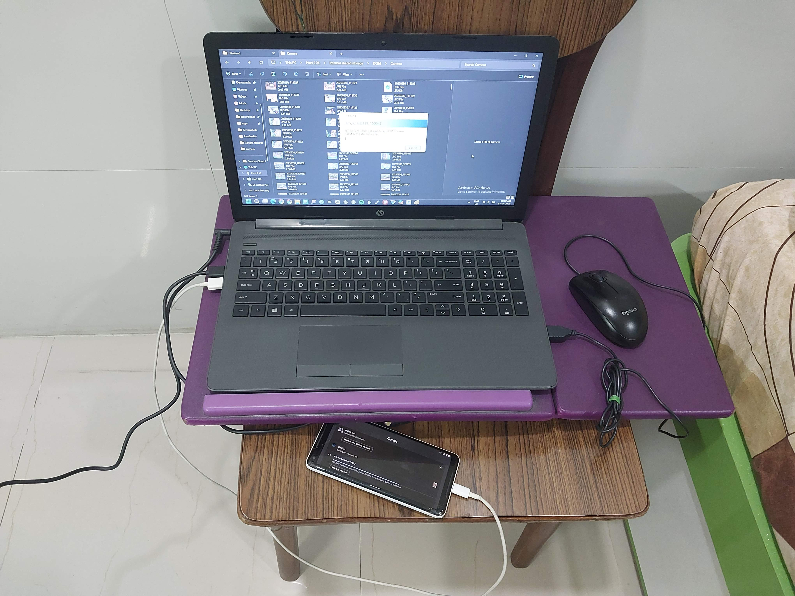
  Developed the first working prototype using a salvaged, boot-looped Pixel 2 XL and configuring Resilio Sync as the data relay. Backing up was an agonizingly manual and monotonous chore. It required tethering the main phone to a laptop, manually indexing and moving files, and then trickling them down to the Pixel. Because the legacy Pixels only have **USB 2.0 ports**, transferring files meant suffering through abysmal USB 2.0 speeds *twice* (Phone → Laptop → Pixel). This turned a simple backup into an unreliable, hours-long headache that heavily relied on pristine cables. Furthermore, using pen drives or external hard drives for these extended transfer sessions caused them to overheat and severely throttle. The system required constant human babysitting and was essentially an "expensive paperweight." *(Pictured right: The bleak, wired reality of V1—a laptop connected to a mouse and a Pixel sitting on a desk.)*
  <br clear="all" />
* **System Regularization & V2 (The Automation Phase - April/May 2025):** 
  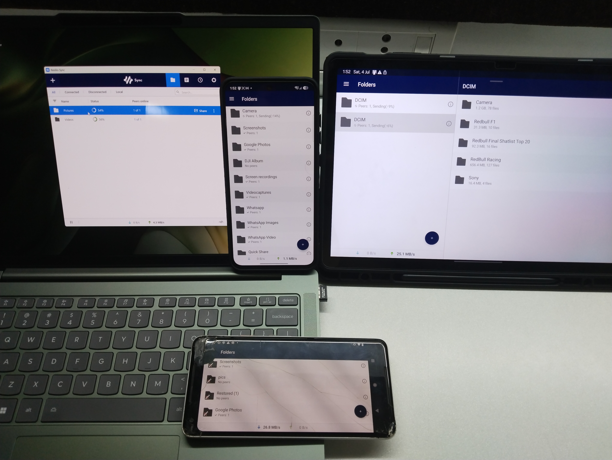 
  Moved past the fragile Version 1 wired workflow and transitioned into a more automated, stable, and fluid system. I introduced Resilio Sync over Wi-Fi, proving the concept by effortlessly syncing 80GB of 4K drone/camera footage without any cables. *(Pictured left: Three devices wirelessly backing up to the Pixel over Wi-Fi, which then seamlessly uploads to the cloud.)*
* **V3 (The Intervention-Free Phase & All-in-One Form Factor - Present):** 
  
  The current architecture and hardware form factor. Leveraging Smart Home integrations, geofencing, and advanced automation, the system now runs perpetually without human intervention. The phone, low-wattage adapter, and coiled USB-C cable are integrated into a single self-contained unit that can simply hang on a wall outlet—eliminating cable mess and clearing desk space entirely.
<br clear="all" />


---

## How It Works (The Architecture)

This system acts as a **digital funnel**. Your modern phone (iPhone/Android) or tablet securely pours data into the "Pixel Funnel" over your local Wi-Fi. The Pixel then "spoofs" the source of the data, allowing it to flow into the infinite ocean of Google Photos using its legacy unlimited backup benefit.

1. **Secure Transfer (Local & Global WAN):** Your phone's camera roll syncs to the Pixel via **Resilio Sync** — a P2P protocol with full End-to-End Encryption (AES-128/256). **You do not even need to be on the same Wi-Fi network:** leveraging BitTorrent global trackers, DHT, NAT hole-punching, and encrypted relay servers, your devices can be anywhere in the world (hotel Wi-Fi, coffee shop, or cellular data) and still seamlessly stream photos directly to your home Pixel node.
2. **Infinite Cloud:** Google Photos on the Pixel detects the new files and uploads them in the background using the device's legacy unlimited backup entitlement.
3. **Auto-Purging (The Pixel Buffer):** The Pixel's internal storage acts as a temporary buffer. Android's Smart Storage automatically clears backed-up files every 30/60/90 days — it self-cleans without any user action.
4. **Passive Confirmation:** Real-time push notifications alert your main device when a batch finishes uploading via Google Photos Partner Sharing.
5. **Freeing Up Main Device Space:** Because your photos are safely in the cloud, you can open Google Photos on your *main daily driver* and manually tap **"Free up space"** to reclaim gigabytes of local storage.
   - *Real-world benchmark:* A single cleanup session safely reclaimed **91.74 GB of storage** (purging 5,722 items in batches of 2,000 / 2,000 / 1,722), reducing the primary daily driver's storage from 253.3 GB (98% full) down to 161.1 GB (63% used).

<div align="center">
  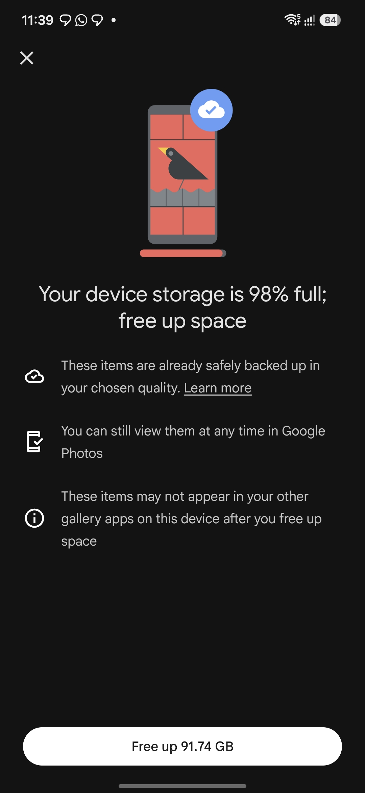
  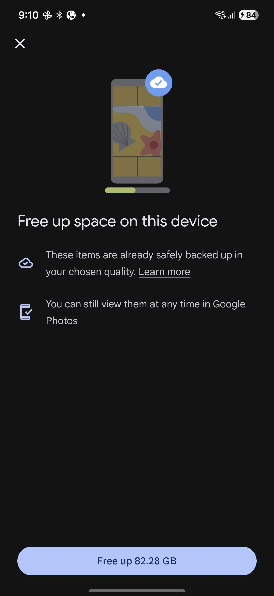
  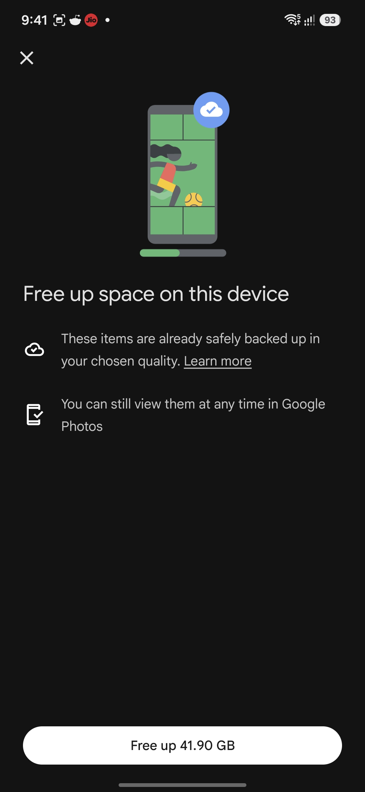
</div>

> **Important distinction:** Step 3 (auto-purge) happens automatically on the Pixel buffer only. Your **main phone's** Google Photos cannot auto-delete — that always requires a manual tap from you. This is intentional — auto-deleting photos from your primary device would be dangerous.

### The Pipeline Flowchart

```text
[ 📱 Main Phone / 💻 PC ]
          │
          │ (1. New media captured)
          ▼
          ├─► [ ⚡ Optional: Geofencing/Wi-Fi/Voice triggers Smart Plug to power Pixel-NAS ]
          │
          │ (2. Wi-Fi / Resilio Sync — E2E Encrypted Transfer)
          ▼
[ 📱 Pixel-NAS Internal Buffer (64GB/128GB) ]
          │
          │ (3. Google Photos App detects new media)
          ▼
[ ☁️ Google Photos Cloud (Unlimited Upload) ]
          │
          │ (4. Upload finishes)
          ├─► [ 🗑️ Pixel Auto-purges buffer on schedule — automatic ]
          │
          │ (5. Partner Sharing Notification)
          ▼
[ 📱 Main Phone ] (Receives notification that backup is complete)
```

---

## Performance & Speeds

Through rigorous pipeline optimization, wireless syncing is now effectively as fast as a wired connection.

* **Average Speeds:** 30 Mbps to 70 Mbps.
* **Peak Speeds:** Up to 150 Mbps.

### Real-World Transfer Benchmarks

| Files | Total Size | Transfer Time |
| :--- | :--- | :--- |
| **500** | 4 GB | 3 min |
| **10,000** | 85 GB | 42 min |

### How to Achieve 150 Mbps:
1. **5GHz Wi-Fi:** Both the source device and the Pixel-NAS must be connected to a clean 5GHz network.
2. **Direct Connection:** Ensure Resilio Sync is using "LAN Sync" and a direct P2P connection (no relay servers).
3. **Advanced Tweaks:** For trusted local networks, disabling `lan_encrypt_data` in Resilio's advanced settings reduces CPU overhead, allowing the devices to focus purely on disk I/O and transfer speed.

> **VPN & DNS Note:** Turn off your VPN entirely during sync sessions. VPN interferes with both Resilio Sync's local peer discovery *and* Google Photos' device identity verification — both require a direct connection. Custom DNS servers (e.g., 1.1.1.1, 8.8.8.8) are fine and do not break the pipeline.

---

## Reliability & Operational Metrics

Production usage statistics gathered over extended operational testing show the robustness of the automated V3 pipeline:

| Metric | Value | Operational Details |
| :--- | :--- | :--- |
| **Continuous Operational Runtime** | **18+ months** | Ongoing production operation across multiple daily devices |
| **Total Verified Backups** | **100,826 photos/videos (~1.8–2.0 TB)** | Empirical volume includes 4K/1080p video, RAW camera captures, and photos |
| **Edge-Case Storage Lockdowns** | **4 full factory resets** | Historical incidents where storage overfilled to 23 KB before implementing the 55GB auto-kill switch |
| **Full Disaster Recovery Time** | **~30–45 minutes** | ~5 min for automated Termux scripts; ~25–40 min for sideloading pinned APKs (APKMirror/local backup), Android permission grants, NetGuard rules, and Resilio/Partner Sharing re-linking |

---

## Automation & Smart Home Triggers (V3)

The beauty of V3 is that the Pixel-NAS only works when it needs to. Using Smart Plugs and Automation apps, I control the power and sync cycles dynamically.

> 💡 **Detailed Automation Guide:** For step-by-step instructions on how to build these automations in MacroDroid and Tasker, see the [AUTOMATION_MACROS.md](AUTOMATION_MACROS.md) guide.

### 1. Geofencing (Samsung Routines / Apple Shortcuts)
When you enter a ~15-meter radius of your home, a location-based routine triggers your Smart Plug to turn on. The Pixel receives power, wakes up, and immediately begins pulling the day's photos over Wi-Fi. No manual tapping required.

### 2. Wi-Fi Triggers (MacroDroid)
Using an automation app like **MacroDroid**, you can configure the Pixel to force-launch the sync protocol the exact moment it detects your home Wi-Fi SSID, ensuring background processes haven't put Resilio Sync to sleep.

### 3. Voice & Remote Triggers (Alexa / Google Home)
If a sync stalls, or if you need to force a backup remotely, you can map the smart plug to a voice command (e.g., *"Alexa, turn on Pixel NAS"*). Because the plug is connected to your smart home ecosystem, you can trigger backups from anywhere in the world.

### 4. Hardware Battery Management
Leaving a phone plugged in 24/7 destroys the battery. V3 uses a **5W (1A) charger** routed through a **4-port USB hub**. The hub acts as a resistor, creating a permanent "Charging Slowly" state. The battery stabilizes at ~45–50% and holds there indefinitely without heat cycles or swelling.

For users without smart home integration, a simpler approach works well: manually plug the Pixel in for **30 minutes to 1 hour per day**. That is enough to keep it running while protecting battery health. A Wi-Fi smart plug (Google Home / Alexa / Apple Home compatible) with a scheduled on/off routine is the recommended upgrade — it makes this fully automatic.

* **Advanced Home Assistant Integration:** Power users can link their smart plug to **Home Assistant** and configure an automation based on the Pixel's actual battery percentage (e.g., turn plug ON at 20%, OFF at 80%) rather than relying on a static time schedule.

### 5. Physical Hardware & Form Factor ("All-in-One Plug & Play Node")

The physical build transforms the salvaged Pixel 2 XL into a completely self-contained, modular appliance:

* **All-in-One Portability & Zero Desk Footprint:** Heavy-duty Velcro strips securely bond the Pixel 2 XL, a low-wattage 7.5W charging adapter, and a coiled USB-C cable into a single integrated unit. It can be thrown anywhere or plugged into any wall socket. Even in rooms with no desk or shelf near the outlet, the entire assembly hangs securely suspended from the wall plug itself.
* **Built-in Stand / Digital Photo Frame:** When placed on a flat desk or bedside table, the rear charger-and-cable bundle doubles as a sturdy kickstand, propping the phone up at an optimal viewing angle to function as an ambient digital photo frame.
* **Camera Lens Scratch Protection:** A dedicated Velcro strip across the upper rear glass section acts as a physical riser, keeping the camera lens elevated away from rough table surfaces to prevent scratches.
* **Ambient Smart Node Capabilities:** Beyond backing up terabytes of photos, the always-on node serves multiple passive utility functions:
  - 🗣️ **Google Home Replacement & Voice Hub:** Dual front-facing stereo speakers and far-field microphones allow the node to act as a permanent Google Home device. Voice commands can adjust AC temperatures, control smart lights, toggle plugs, set timers, and trigger Google Home routines.
  - 🤏 **Active Edge ("Pixel Squeeze"):** Hardware pressure sensors along the Pixel's frame allow you to activate Google Assistant or Gemini with a quick physical squeeze of the phone body—no wake words or screen taps required.
  - 🎵 **"Now Playing" Song Identification:** Leverages Pixel's native on-device ambient music recognition to display whatever song is playing in the room.
  - ⏰ **Always-On Display & Night Clock:** Shows live time, date, weather, and battery health at a glance.
  - 🎧 **Spotify Connect Controller:** Acts as a dedicated room controller for audio playback across connected speakers.
  - ⚡ **Local Termux Node:** Runs a background Node.js telemetry server for the PWA dashboard.

<div align="center">
  <!-- Prioritized Hero Views: Active Screen & Mounting -->
  
  
</div>
<div align="center">
  <!-- Hardware Construction & Protection Details -->
  
  
</div>

---

## On-Device Visual Telemetry (Home Screen Widgets)

To eliminate the need to constantly open Android Settings or terminal sessions just to check node health, the Pixel 2 XL home screen is configured with dedicated live widgets:

* **🔋 Battery & Temperature Widget ([Battery Widget Reborn 2026](https://play.google.com/store/apps/details?id=net.hubalek.android.apps.reborn.pro)):** Displays real-time battery percentage, charging duration, discharge estimation, and live hardware temperature in Fahrenheit and Celsius (🌡️). *(Essential for monitoring thermal buildup during heavy 10GB+ bulk ingestions).*
* **💾 Live Storage Bar (Storage Gauge):** Provides an instant visual gauge of buffer capacity (ensuring storage never nears the dangerous 55GB+ zone).
* **🛡️ Ad-Free Operation via NetGuard:** Both utility widgets run with zero ads or tracking by using NetGuard to cut off their internet access entirely while leaving Google Photos unhindered.
* **📱 Hardware Screen Compensation:** Salvaged Pixel 2 XL OLED panels often develop minor artifacts around the top status bar icons; a large center-screen battery widget ensures percentage legibility at all times.

<div align="center">
  <!-- Primary Home Screen Dashboard View -->
  
</div>
<div align="center">
  <!-- Matching Notification Shade & Charging Telemetry Cards -->
  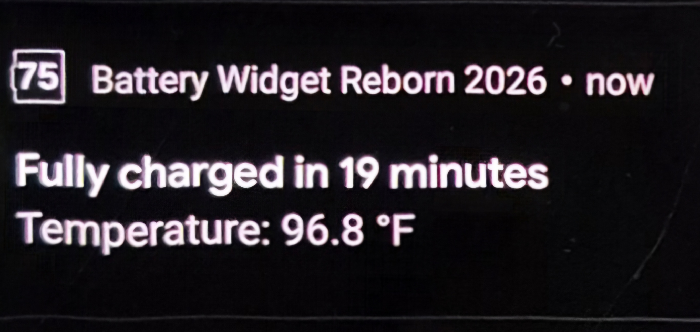
  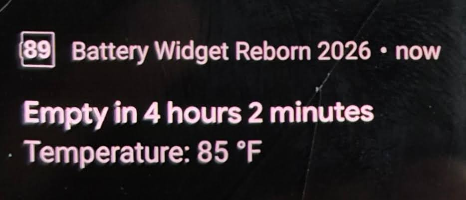
</div>

---

## Real-World Battery Endurance & Thermal Telemetry (Unplugged Benchmark)

To verify the energy efficiency and thermal profile of the Pixel 2 XL acting as an autonomous node, I conducted an extended, real-world **unplugged drain test** from **August 17 to August 19, 2026**:

### 📊 Benchmark Conditions & Operational Load
* **Initial State:** Charged to **97%** on Monday, Aug 17 at 11:07 PM.
* **Duration:** **45.3+ Hours (~1.9 Days)** continuously unplugged from the wall.
* **Ending State:** **12% Battery** remaining on Wednesday, Aug 19 at 8:44 PM (concluded test; plugged in with ~5h 51m estimated idle life remaining).
* **Active Background Load:**
  - 🌙 **Always-On Display (AOD):** Kept active 24/7 (clock, date, Now Playing music detection).
  - 📶 **Wi-Fi & P2P Connectivity:** Always-on LAN socket for Resilio Sync listening.
  - ☁️ **Google Photos Cloud Sync:** Background indexing, video encoding, and cloud uploading.
  - 📈 **On-Screen Telemetry Widgets:** Live visual rendering of storage capacity and battery discharge graphs.
  - 🧹 **Active Buffer Purge:** Buffer filled up to 58.4 GB (~97% full) during the test and was safely purged back down to 23.2 GB without interrupting node operation.
* **⚡ Ambient Sync vs. Heavy Burst Video Ingestion:**
  - **Ambient Sync (Hours 0 – 41):** Routine photo batches (~500MB – 1GB) show up as tiny, subtle dips along a very gentle baseline drain curve (~1.46%/hr).
  - **Massive Video Ingestion Burst (Hours 41.1 – 43.75):** Recorded and synced an unbroken **~30-minute 1080p 30fps video (~6.4 GB)** plus a 42-second clip (~170 MB), totalling **~6.57 GB of continuous burst ingestion**. The simultaneous high-bandwidth Wi-Fi transfer, rapid flash NAND writes, and intensive Google Photos video processing caused a steep, visible discharge from **37% down to 12%** in ~2.65 hours.
  - **The 15% Resilio Safety Cut-off & Idle Flatline (Hours 43.75 – 45.3+):** Resilio Sync's built-in battery saver halts sync whenever battery drops below **15%**. This is a deliberate design choice that prevents sudden device brownouts, avoids corrupting Google Photos indexing queues, and allows the node to maintain deep standby for hours (flatlining at **12% battery** with ~6 hours of remaining standby).

### 📈 Discharge & Thermal Metrics

| Metric | Measured Value | Operational Insight |
| :--- | :--- | :--- |
| **Total Runtime (Unplugged)** | **45.3+ Hours** | 97% → 12% (85% consumed over ~1.9 days under mixed idle + burst load) |
| **Baseline Idle / Ambient Drain** | **~1.46% / hour** | ~35% battery consumed per 24 hours under standard background sync |
| **Heavy Video Ingestion Drain** | **~9.4% / hour** | Continuous 6.5GB+ video Wi-Fi sync, local flash writes, and cloud upload |
| **Projected Total Battery Life** | **~50–70 Hours (~2–3 Days)** | Easily withstands extended power outages even with active data ingestion |
| **Idle Thermal Profile (AC active)** | **67°F – 69°F (~19.4°C – 20.5°C)** | Sub-ambient thermal dissipation with room AC active |
| **Standard Thermal Profile** | **77°F – 79°F (~25.0°C – 26.1°C)** | Nominal room temperature during active ingestion and conclusion |

### 📊 Plotted Battery Discharge Curve

<div align="center">
  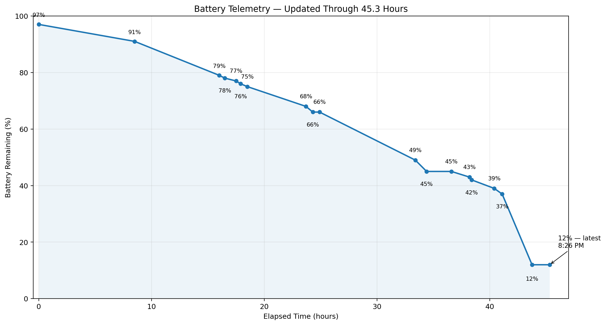
</div>

### 🗓️ Key Milestone Telemetry Checkpoints

| Checkpoint | Elapsed | Battery % | Storage Buffer | Temp | Operational Event & System Notes |
| :--- | :--- | :--- | :--- | :--- | :--- |
| **Mon, Aug 17 · 11:07 PM** | 0.0 hrs | **97%** | 56.9 GB (95%) | — | 🔌 Unplugged from 7.5W adapter; benchmark begins |
| **Tue, Aug 18 · 07:34 AM** | 8.5 hrs | **91%** | 56.8 GB (95%) | — | 🌙 Overnight standby with Always-On Display (0.71%/hr baseline) |
| **Tue, Aug 18 · 03:04 PM** | 16.0 hrs | **79%** | 57.7 GB (96%) | — | 🔄 Background P2P LAN sync & incoming media ingestion |
| **Tue, Aug 18 · 10:51 PM** | 23.7 hrs | **68%** | 58.4 GB (97%) | **77°F (25°C)** | ⏱️ 24-Hour Milestone: only 29% battery consumed in 1 full day |
| **Wed, Aug 19 · 08:28 AM** | 33.4 hrs | **49%** | 58.4 GB (98%) | **67°F (19.4°C)** | ❄️ AC blasting at peak; temperature drops to sub-ambient 67°F |
| **Wed, Aug 19 · 09:31 AM** | 34.4 hrs | **45%** | 23.1 GB (38%) | — | 🧹 **Storage Purged:** 35.3 GB cleared via Google Photos Free Up Space |
| **Wed, Aug 19 · 04:13 PM** | 41.1 hrs | **37%** | 23.2 GB (38%) | — | 📱 Routine ambient sync baseline before video burst |
| **Wed, Aug 19 · 06:52 PM** | 43.75 hrs | **12%** | ~29.8 GB (49%) | — | 📹 **Heavy Video Burst:** Ingested **6.57 GB** (30-min 1080p video); steep 25% drain |
| **Wed, Aug 19 · 08:26 PM** | 45.3 hrs | **12%** | ~29.8 GB (49%) | **79°F (26.1°C)** | 💤 **Test Concluded:** 15% Resilio safety cut-off halts sync; battery flatlines at 12% (~6h remaining) |

<div align="center">
  <!-- Progression of the 41-hour unplugged drain test -->
  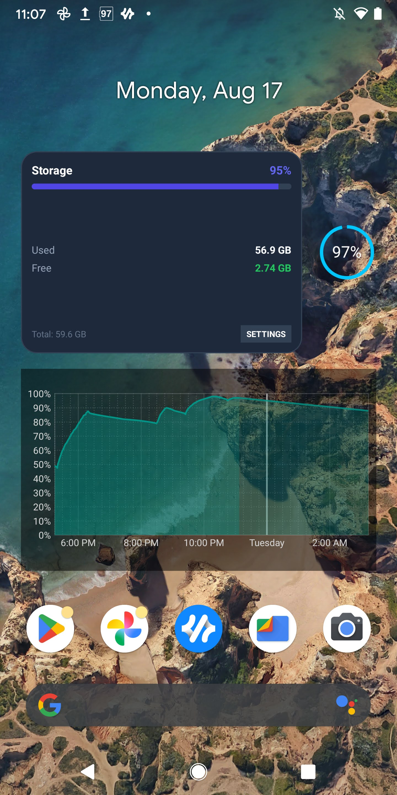
  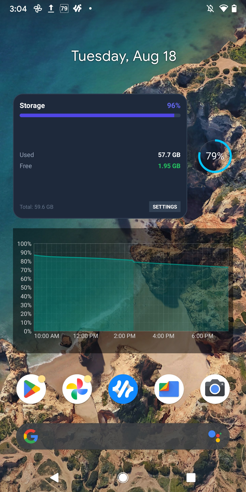
  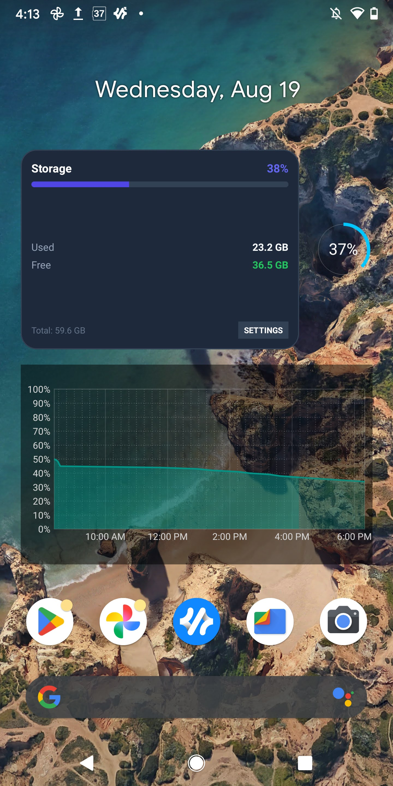
</div>
<div align="center">
  <!-- Clean Cropped Thermal Telemetry Cards -->
  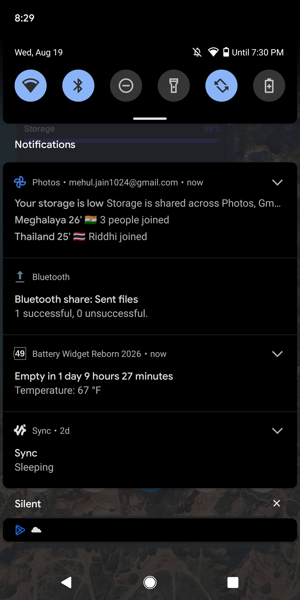
  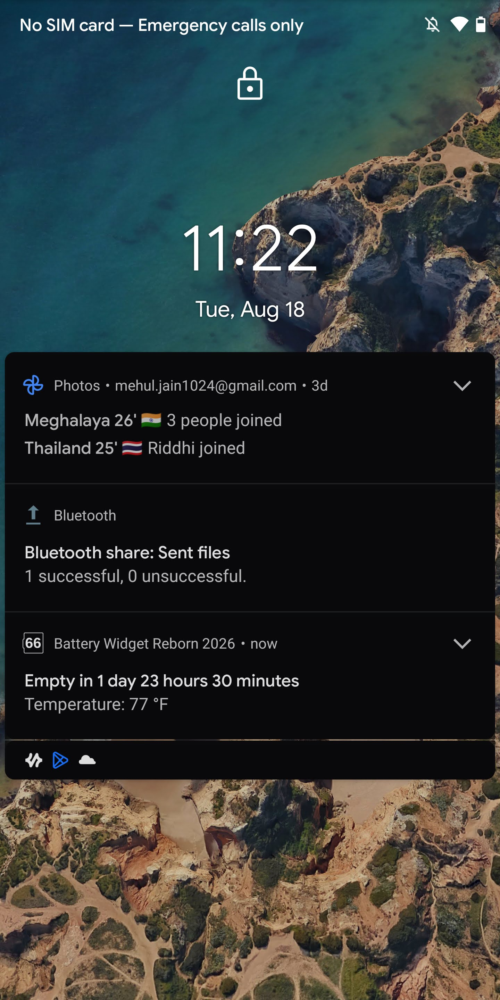
</div>

---

## Hardware Bill of Materials

### 📱 Choosing the Right Pixel (Which generation to buy?)

If you are buying a device specifically for this project, the most straightforward and highly recommended option is the **Google Pixel 1 (128 GB)**. The 128GB model gives you a massive internal buffer to prevent "Storage Full" bottlenecks during large bulk uploads, and the Pixel 1 is the *only* generation that retains **Original Quality** backup for life.

> **Storage Capacity Warning:** The Pixel's internal storage is a live buffer. If it fills up, the pipeline stalls. With a 64GB Pixel, try to keep storage usage below **55–60GB** at most — beyond that, the pipeline tends to break and requires manual intervention. Heavy users (100–300+ photos/day, regular videos) are strongly advised to get the **128GB model**, where Smart Storage's auto-purge will keep up automatically without any manual attention.

Here is the exact breakdown of Google's legacy backup policies across generations:
* **Pixel 1 (2016):** Unlimited backup at **Original Quality** (Uncompressed), forever. *(The Holy Grail).*
* **Pixel 2 (2017) & Pixel 3 (2018):** Their Original Quality promo expired. They now offer unlimited backup at **Storage Saver (High) Quality** for life.
* **Pixel 3a, 4, 4a, 5:** Unlimited backup at **Storage Saver (High) Quality** for life.
* **Pixel 5a & newer (6, 7, 8, etc.):** No unlimited backup benefit. Do not buy these for this project.

### 🛠️ Hardware List

| Component | Recommendation | Purpose |
|---|---|---|
| **Google Pixel** | **Pixel 1 (128GB)** | The ultimate backup engine (Original Quality for life). |
| **Power Supply** | 5W (1A) Charger | Low-wattage charging for battery stability. |
| **Resistance Hub** | 4-Port USB Hub | Adds electrical resistance for trickle charging. |
| **Smart Plug** | Google Home/Alexa compatible | Required for Geofencing & Voice triggers. |
| **Cooling** | Aluminum Foil / Heat Sink | Passive heat dissipation across the back glass for 80GB+ bulk uploads. |

*Estimated cost from scratch: $15–$30 (mostly the smart plug). The Pixel itself can often be sourced for $30–$50 on eBay or salvaged for free.*

#### Battery Safety — Warning Signs (Pixel 1 is ~9 years old)
The Pixel 1's battery is aging hardware. If you observe any of the following, **power off and disconnect the device immediately**:
- Screen lifting away from the frame at any corner
- Back cover visibly bulging outward
- Unusual heat at idle (not during a sync — just sitting there warm)

Run the phone in a well-ventilated, visible location. Never in a closed box, drawer, or shelf compartment. Check it physically once a week.

#### Cooling for Heavy Loads
During large batch uploads, the Pixel 1 (Snapdragon 821) can thermally throttle, which slows uploads or pauses Google Photos backup entirely. Beyond the aluminum foil heat sink, additional options:
- **Active gaming cooler** — a clip-on Peltier/fan cooler attached to the back during heavy sync sessions
- **Fan automation** — add a second smart plug controlling a desk fan; when the Pixel's charging smart plug turns ON, the fan also turns ON via a smart home routine. Fully automatic, zero effort.

---

## Alternative: Device Spoofing & Virtual Nodes (Disclaimer)

> [!CAUTION]
> ### ⚠️ Crucial Disclaimer & Terms of Service Warning
> **I do not personally use, recommend, or deploy device spoofing for my primary production pipeline (which manages an archive of 100,000+ irreplaceable family photos and videos / ~2 TB of data).**
>
> Spoofing a Pixel device signature directly violates [Google's Terms of Service](https://policies.google.com/terms). While community ban rates have historically been near zero, using software spoofing on an account holding years of precious memories carries serious risks: Google can terminate accounts or revoke quotas at any time, modules can silently break after Android/Photos updates (causing sudden quota exhaustion), and system-wide spoofing breaks Play Integrity for banking and security apps.
>
> **The physical hardware approach (a genuine Pixel 1–5 node) remains the only 100% legal, zero-maintenance, zero-ban-risk method.**

While physical hardware is the safest approach, it is technically possible to spoof a Google Pixel 1/XL identity on non-Pixel Android phones using custom ROMs (such as **crDroid** or **Evolution X**), root modules (**Magisk / Zygisk / KernelSU** via Pixelify or GPhotosUnlimited), or even by converting an old, battery-less laptop into a perpetual **Android-x86 / Bliss OS** backup node.

👉 **For the full technical breakdown, module rankings, and "Partner Sharing Mule" risk mitigation strategies, see the standalone [Device Spoofing Guide](DEVICE_SPOOFING_GUIDE.md).**

---

## Setup Guide

**1. Prepare the Device & App Update Policy**
- **Factory reset the Pixel.** Use Android Universal Debloater (ADB) to strip bloatware, maximizing the internal buffer and freeing up CPU cycles for the sync and upload tasks.
- **Disable Global Play Store Auto-Updates (Crucial):** Open Google Play Store → Profile → **Settings → Network Preferences → Auto-update apps → Select "Don't auto-update apps"**. On an autonomous server node, you want zero unexpected background update churn or UI rewrites that could break pipeline stability.
- **App Update Strategy:**
  - 🔄 **Google Play Store & Play Services:** Updates automatically at the system level in the background.
  - 📂 **Files by Google:** Manually updated to the latest stable build for fast storage health checks.
  - 📶 **Resilio Sync:** Installed as the latest stable build directly from the Google Play Store for optimal P2P LAN performance.
  - 📊 **Telemetry Widgets (Battery & Storage Gauges):** Installed from Play Store, then firewalled via NetGuard (Step 7).

**2. Configure Google Photos (Version Pinning)**
- **Tested Stable Build:** Sideload and pin **Google Photos v7.5 / 8.0.855792468 (or stable v6.5+ builds)**. Newer Android 14+ UI updates introduce memory-heavy background indexing services and UI bloat that choke older Snapdragon processors during prolonged ingestion. Ensure auto-update is explicitly disabled (`Google Photos on Play Store → ⋮ (top-right) → Uncheck "Enable auto-update"`).
- Log in with a **dedicated backup Google account** — not your main personal account.
- **Enable backup for ALL folders.** By default, Google Photos only backs up the device's Camera folder. Since Resilio Sync delivers files into a separate synced folder (not the camera roll), you must manually enable backup for every folder Resilio syncs into: Library → scroll down to your folder → tap the ☁️ cloud icon to enable backup for that folder.
- **Set backup quality.** On first setup (or after a factory reset), verify the backup quality setting:
  - Pixel 1: leave at **"Original quality"** — this is the whole point.
  - Pixel 2–5: switch to **"Storage Saver"** — it still receives the free unlimited perk, just compressed. Once set, it does not revert on its own.
  - Path: Profile → Backup → Backup quality
- Turn on the **30-day auto-purge** for the trash.

**3. Setup Resilio Sync (Optimal Node Configuration)**

Install Resilio Sync on both the source device and the Pixel. Cherry-pick specific folders rather than the entire `DCIM` root — this avoids syncing cache files, thumbnails, and other junk. **Disable Selective Sync** so files transfer immediately, and enable **LAN Sync** for maximum speed.

**Critical Resilio Settings on the Pixel:**

* **⚠️ Set folder mode to "Receive Only":** In Resilio Sync on the Pixel, set the synced folder mode to **Receive Only**. This is non-negotiable. Without it, when Google Photos runs "Free Up Space" and deletes backed-up files from local storage, Resilio detects them as "missing" and re-downloads them from your source — an infinite loop that continuously refills the Pixel's storage.
* **🛡️ Battery Saver (<15% Threshold = ON):** In `Resilio Sync → Settings → General`, keep **Battery saver** enabled (*"Stop syncing if battery lower than 15%"*). This protects the device from sudden shutdowns during active database indexing or file transfers, preventing Google Photos sync corruption.
* **⏱️ Auto-Sleep Configuration:** Keep **Auto-sleep** enabled with **30-minute activity checks** on battery, and **5-minute activity checks** while charging. This keeps the app hyper-responsive when plugged into power while saving precious energy during unplugged operation.
* **🔔 Notification Bar Icon = ON:** In `Resilio Sync → Settings → Notifications`, enable **Show notification bar icon**. This maintains Android foreground service priority so the OS never silently kills Resilio during large multi-gigabyte transfers.
* **🔋 Android Battery Optimization = Unrestricted:** Go to `Android Settings → Apps → Resilio Sync → Battery → Set to Unrestricted`.

<div align="center">
  <!-- Verified Resilio In-App Configuration Screens -->
  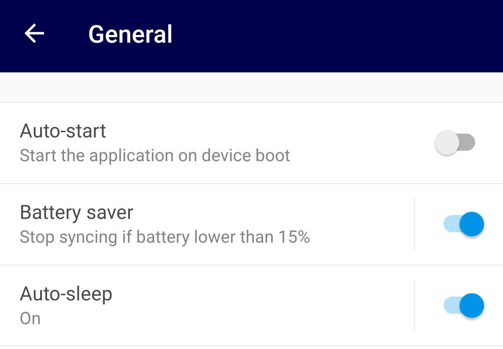
  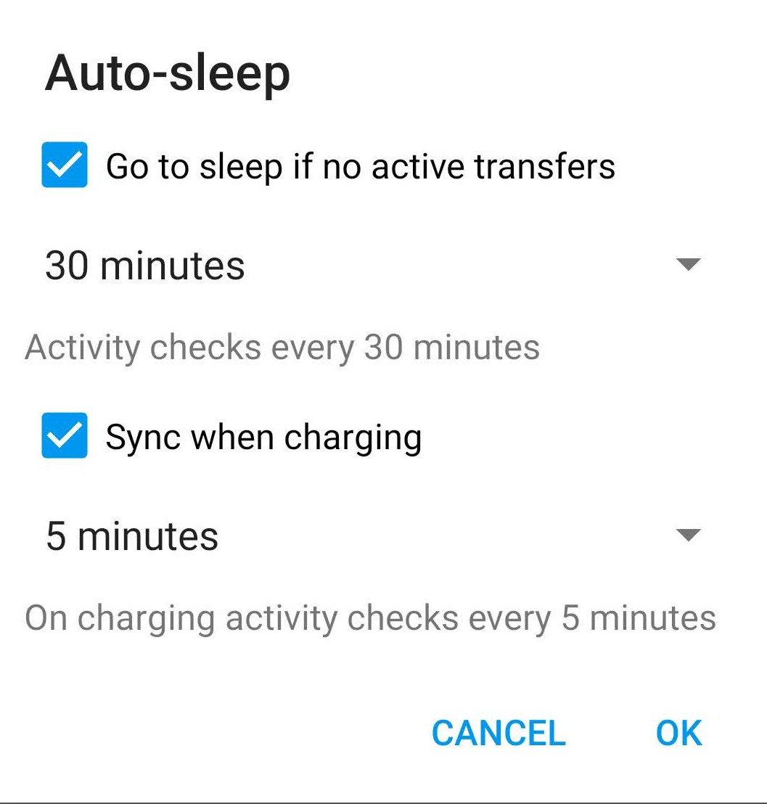
  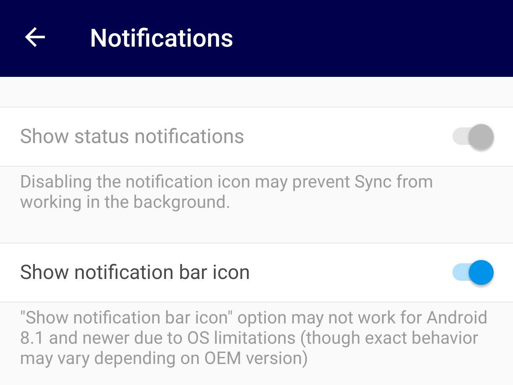
</div>

<div align="center">
  <!-- Folder Selection Guides -->
  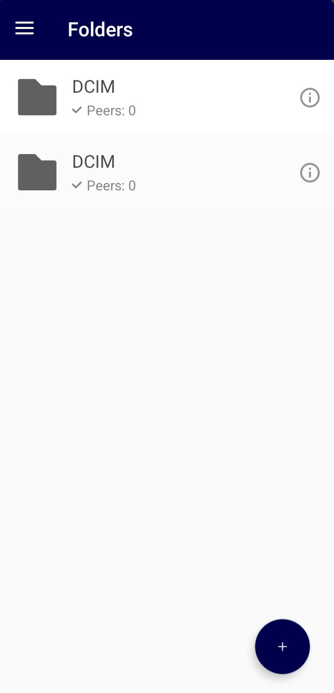
  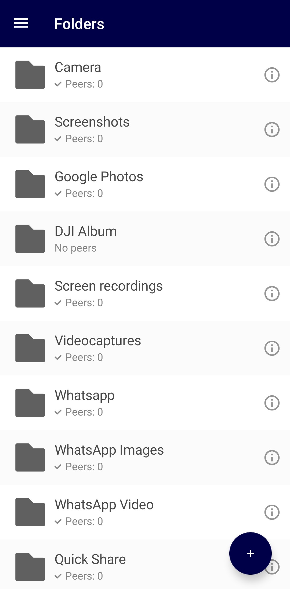
</div>

**4. The Hardware Hack**
Connect: Wall Outlet → Smart Plug → 5W Charger → USB Hub → Pixel. Verify it says "Charging Slowly."

**5. Set up Automations**
Use Samsung Routines, Apple Shortcuts, or MacroDroid to create a trigger: `IF Location = Home → THEN Turn On Smart Plug`.

**6. Setup Partner Sharing (For Backup Notifications)**

Partner Sharing is not a core requirement — the backup works entirely without it. Its purpose is to give you a push notification on your main phone when the Pixel finishes backing up a batch.

> **Note:** Google Photos only supports **one active Partner Sharing relationship at a time.** If you already have one set up, you'll need to remove it first.

* On the **Pixel NAS** (logged into its dedicated backup account), open Google Photos.
* Go to: **Profile → Photos settings → Sharing → Partner Sharing → Get started**
* Invite your **main Google account email** → set to share **"All photos"**
* On your **main phone**, open Google Photos and accept the invitation
* Enable notifications: main phone → Google Photos → Profile → Photos settings → Notifications → **Sharing = ON**
* Also verify at system level: Settings → Apps → Google Photos → Notifications → all ON
* **How it works:** When the Pixel backs up a new batch, those photos populate in your main phone's "Sharing" tab, and you receive a batch push notification confirming the backup cycle completed.
* **For third-party media** (screenshots, WhatsApp photos, etc.): enable **Photos settings → Sharing → Partner Sharing → "Include content from other Android apps"** (added in early 2025).
* *If notifications stop: remove the partner, wait 10 minutes, re-invite.*

**7. NetGuard Surgical Firewall (Zero-Root Ad Blocking for Utility Widgets)**
If using third-party Play Store widget apps for storage/battery monitoring, isolate them using **NetGuard** (open-source no-root firewall by Marcel Bokhorst / FairCode BV):
1. Install NetGuard from GitHub / F-Droid / Play Store.
2. In NetGuard, tap the Wi-Fi and Mobile Data icons next to the widget utility apps to turn them **RED (blocked)**.
3. Keep Google Photos, Resilio Sync, Termux, and Google Play Services unblocked.
4. Enable NetGuard's master switch (creates a local dummy VPN interface).
5. *Result:* Widget apps run locally with zero ads and zero data leaks, while Google Photos maintains 100% uninhibited gigabit upload bandwidth.

> **⚠️ Quick Share / Nearby Share Conflict:** Because NetGuard operates by establishing a local loopback VPN interface (`127.0.0.1` / `tun0`), Android's Wi-Fi Direct socket negotiation used by **Quick Share** can fail or drop connections. If you ever need to manually Quick Share large one-off files or test direct drops from your main phone/tablet directly to the Pixel, simply **toggle NetGuard OFF temporarily**, complete the transfer, and toggle it back ON.

**Alternative Notification Method (MacroDroid / Tasker):**
If you prefer not to use Partner Sharing, you can use automation apps like MacroDroid or Tasker directly on the Pixel. These can monitor the Google Photos app state, folder modification times, or backup status, and fire a custom webhook or push notification to your main device when the sync completes. This is often a cleaner approach, though it requires more initial setup.

> **⚠️ Disconnecting Partner Sharing:** If you have auto-saved partner photos into your main account's library and then disconnect Partner Sharing, those saved copies may suddenly start counting against your 15 GB quota. Be aware of this before removing the relationship.

---

## How to Verify Your Backup is Working

You need to confirm photos are being uploaded by the **Pixel** (free, no quota used), not silently by your main phone.

**Step 1 — Disable backup on your main device.** Google Photos on main phone → Profile → Backup → **Backup OFF**. This is mandatory. If both devices have backup enabled simultaneously, you cannot determine which one is actually doing the uploading.

**Step 2 — Check the cloud icon.** On your main phone, open Google Photos and look at recent photos. A small **☁️ cloud icon** on or next to a photo means it has been backed up.

**Step 3 — Deep verification.** Open a recently taken photo → swipe up (or tap the ⓘ info button). You should see both:
- **"Backed up"** — it's in the cloud
- **"This item doesn't take up space in your Google Account storage"** — this is the confirmation that it was uploaded by the Pixel's legacy entitlement, not by your main device eating your 15 GB quota

<div align="center">
  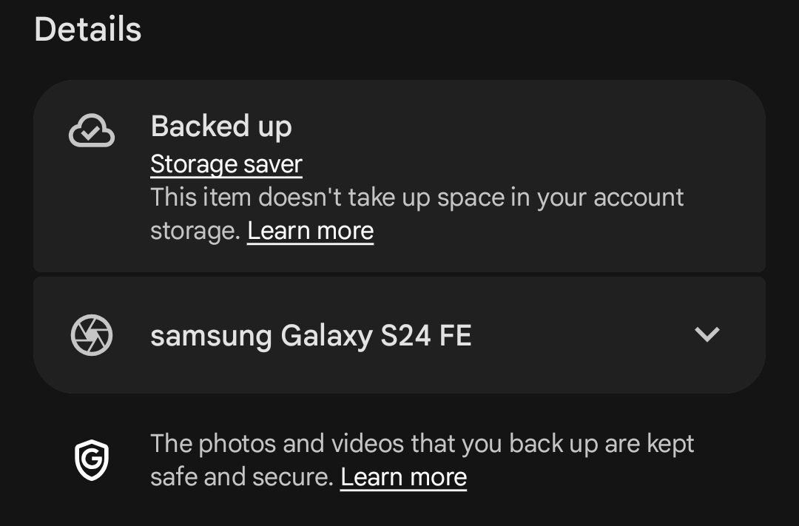
  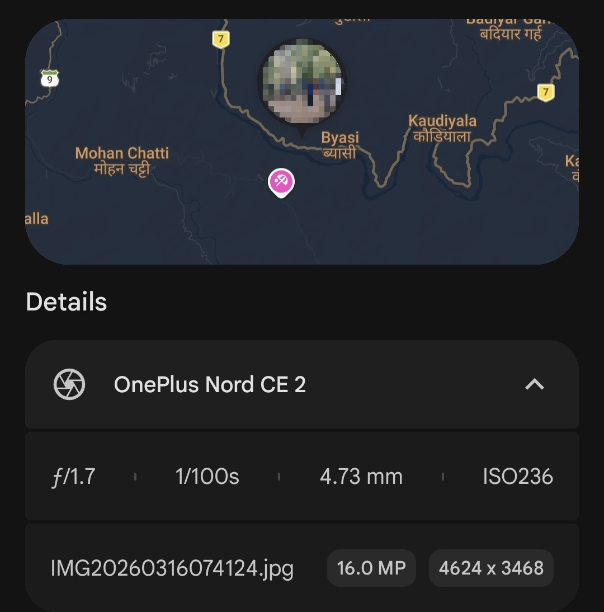
  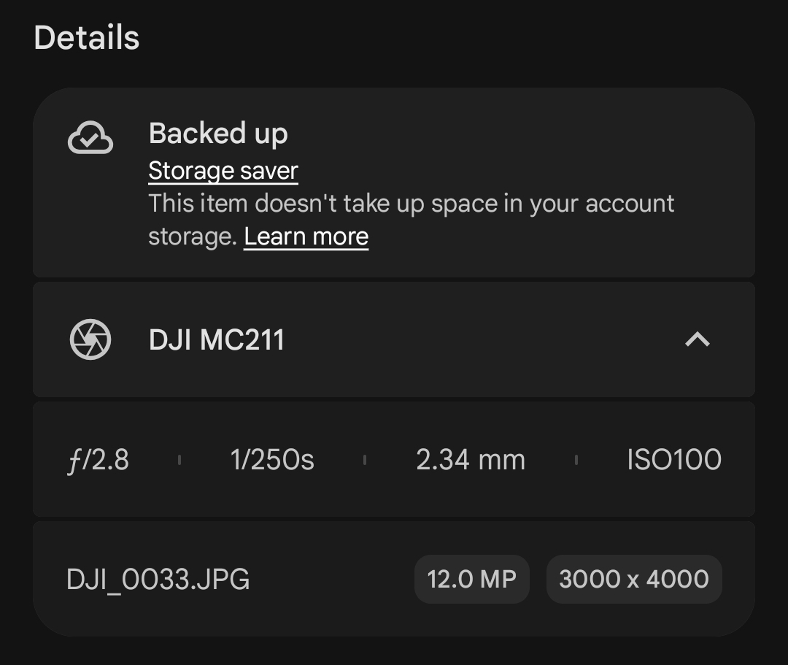
</div>

**Step 4 — Cross-check.** Open [photos.google.com](https://photos.google.com) in a desktop browser while logged into the backup account. Confirm recent photos are visibly present.

**What backup quality should show:**
- Pixel 1: **"Original quality"** + "doesn't count against storage" ✅
- Pixel 2–5: **"Storage Saver"** + "doesn't count against storage" ✅ (still free, just compressed)
- **Any device — bad state:** Any quality + "counts against storage" ❌ — something is misconfigured

> **Note:** Google removed the "Unlimited storage" badge from the Google Photos home screen in 2024. Verification must be done via Profile → Backup settings, not the home screen.

### The Pixel 2–5 "Original Quality" Upload Anomaly

While Google's official policy dictates that Pixel 2–5 devices only receive free unlimited backup for **Storage Saver** quality (compressing photos over 16MP and videos over 1080p), real-world testing has revealed a highly beneficial anomaly. 

Certain files from high-resolution external cameras or action cams can trigger an upload in **Original Quality** (uncompressed, full resolution) without consuming any Google Account storage space:

* **High-Megapixel Photos & MPF Tags (The Bypass):** Photos taken on certain **Sony DSLRs** (and other high-resolution cameras) consistently bypass the 16MP Storage Saver limit. This happens because these cameras embed Multi-Picture Format (MPF) metadata tags in their JPEGs. Google Photos' compression algorithm fails to process files containing these specific tags, so it falls back to storing them at **Original Quality** for free (0 bytes of account storage used). As seen in the screenshot below, the camera model is preserved in the EXIF metadata while the file consumes 0 bytes of Google Account storage.
* **Video Resolution Scaling & Aspect Ratios:** Unlike photos, videos are subjected to server-side transcoding, and there is no known "codec trick" to bypass this for videos under the Storage Saver tier. High-resolution videos (like 2.7K 60fps shot on a **DJI Action 2**) do not bypass Storage Saver compression to keep their original 2.7K resolution. Instead, Google Photos scales them to **1920 x 1440** (preserving the 4:3 aspect ratio rather than forcing a standard 16:9 1080p crop/scale) and maintains 60fps frame rate for free.
* **Note on 4K & Video Bypass:** True 4K footage (3840x2160 or 4096x2160) does not bypass compression. It is either compressed down to 1080p (or an equivalent 4:3 scale) or counted against storage.

<div align="center">
  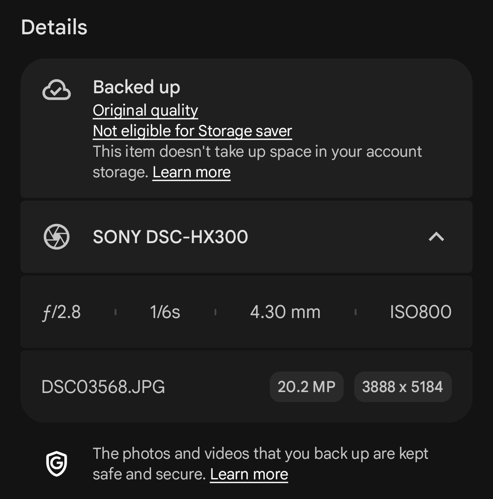
</div>

**Troubleshooting — "Getting ready to backup" is stuck:**

A single corrupted or incompletely transferred file can block the entire upload queue. Google Photos processes one file at a time, so one bad file stalls everything. Fix sequence:
1. Turn Backup OFF → reboot the Pixel → turn Backup back ON
2. Clear Google Photos cache and data (Settings → Apps → Google Photos → Storage → Clear Cache, then Clear Storage)
3. Check the most recently added files — temporarily remove any you suspect are corrupt
4. Keep the app open in the foreground, phone on charger, and wait 30 minutes

Usually just waiting works. There is no guaranteed instant fix — sometimes it resolves on its own.

**Troubleshooting — "Free up space" shows 0 items despite a large library:**

Google Photos hasn't finished indexing which files are safely in the cloud. Clear Photos cache, reopen the app, wait 5 minutes. If still 0, wait 24–48 hours after a large batch upload — the count may increase the next day as indexing completes. It is annoying but harmless.

---

## Advanced: Arbitrary File Backup (BitStream)

Pixel-NAS handles media natively. For documents, code, and zip files, I use [BitStream](https://github.com/mehuljain866/BitStream).
BitStream losslessly encodes any arbitrary file into an FFV1 `.AVI` video file.
1. Compress your files.
2. Run BitStream to turn the ZIP into a Video.
3. Pixel-NAS uploads the "video" to Google Photos.
4. Download the video later and decode it to retrieve your exact files, byte-for-byte.

---

## Advanced: Headless Node (Broken Screen / No-Touch Operation)

If your Pixel's screen is cracked, unresponsive, or you simply want to run it as a pure background node with zero physical interaction, you can control it entirely over Wi-Fi via ADB — no display or touch needed.

> **Note:** Pixel 1–5 do not support DisplayPort over USB-C, so Samsung DeX-style desktop output is not possible. ADB over Wi-Fi is the alternative.

**One-time setup (requires USB for the first connection only):**
```bash
# With Pixel connected via USB:
adb tcpip 5555

# Disconnect the USB cable. Find the Pixel's local IP in Settings → About → Status → IP address.
adb connect <pixel-local-ip>:5555

# All future control is now wireless — no USB needed.
```

**What you can do once connected:**
- Full screen mirror + touch control via **scrcpy** (free, open source): `scrcpy --tcpip=<pixel-ip>`
- Run any ADB command wirelessly — install APKs, toggle settings, reboot, etc.
- Set up **Tasker** on the Pixel to auto-restart Resilio Sync or Google Photos if either crashes, keeping the node fully self-healing

**Caveat:** Android blocks certain privacy-sensitive screens during remote casting (e.g., notification shade on some builds, some system settings menus). Test with scrcpy before going fully screenless to confirm all the controls you need are accessible remotely.

---

## Advanced: The "Daisy Chain" (Low Storage Workaround)

If you have a massive media library (e.g., 500GB) but your Pixel node only has 32GB or 64GB of internal storage, you cannot sync everything directly to the Pixel at once without causing a "Disk Full" crash. The theoretical but elegant solution is a "Trickle-Down Daisy Chain":

**The Architecture:**
`Source Devices` ➡️ `High Capacity Buffer (e.g., PC or NAS)` ➡️ `Low Storage Pixel` ➡️ `Google Cloud`

**How it works (The Automation Loop):**
1. **The Dump:** You send all 500GB to your High Capacity Buffer device.
2. **The Fill:** Resilio Sync on the Buffer device starts syncing to the Pixel. Once the Pixel reaches 100% capacity (e.g., 30GB), Resilio naturally pauses because there is no more space.
3. **The Backup:** Google Photos on the Pixel diligently backs up that 30GB batch to the cloud.
4. **The Ghost Purge (UI Automation):** Because Google does not provide an API to trigger "Free Up Space," you must use an automation app like **MacroDroid** or **Tasker (with AutoInput)** on the Pixel. The app listens for the Google Photos "Backup Complete" notification. When it fires, the automation wakes the screen, launches Google Photos, and simulates physical screen taps (like a ghost) to click Profile ➡️ Free Up Space ➡️ Confirm. *(See [AUTOMATION_MACROS.md](AUTOMATION_MACROS.md) for the exact step-by-step build).*
5. **The Trickle Down Resumes:** Once the 30GB is purged from the Pixel's local storage, Resilio Sync immediately detects the new free space and automatically resumes sending the next 30GB batch from the Buffer device.

This creates an autonomous, self-cleaning pipeline that can trickle terabytes of data through a 32GB phone without human intervention.

---

## Sync Modes

| Mode | Behavior |
|---|---|
| **Buffer Mode** | Files sync to Pixel and back up to cloud. Deleting from Pixel does not affect your main device. Recommended for most users. |
| **Mirror Mode** | Pixel mirrors your main device. Deletions on either side propagate after 30 days. Use only if you want true bidirectional sync. |

---

## Pixel-NAS Dashboard (New!)

I have recently introduced a **Progressive Web App (PWA) Dashboard** to monitor the live telemetry of the Pixel-NAS! Since standard Android background notifications for Google Photos uploads can be highly unreliable, the dashboard queries actual Android logs (`logcat`) via a Termux background server to track backup status and battery levels with 100% accuracy.

Check out the source code and setup instructions in the [`dashboard/`](dashboard/) directory.

---

## Current Status

| What | Status | Notes |
|---|---|---|
| Pixel 1 unlimited Original Quality backup | ✅ STILL ACTIVE (July 2026) | No announced end date |
| Pixel 2–5 unlimited Storage Saver backup | ✅ STILL ACTIVE | Compressed but free |
| Pixel 5a+ unlimited backup | ❌ GONE | Do not use for this project |
| Magisk spoofing modules | ⚠️ WORKS (with caveats) | Android 16 has issues; requires maintenance after updates |
| crDroid / Evolution X built-in spoof | ✅ WORKS | Can reset after OTA update; re-enable in ROM settings |

> **Critical rule:** The free unlimited quota **only** applies to files uploaded directly from the physical Pixel's Google Photos app. Uploading via browser, a different phone, or desktop — even to the same Google account — **will count against your 15 GB quota.**

---

## Known Limitations & Heads-Ups

- **The 64GB Bottleneck & The 23 KB Critical Storage Lockdown:** The Pixel's internal storage is a live buffer. If storage usage exceeds 55–60GB and reaches absolute zero (e.g. **23 Kilobytes free** as reported by Google Files), Android's internal SQLite databases, MTP daemons, and background tasks lock down completely. In this state, even connecting the Pixel to a PC via USB cable fails to delete files because the MTP process crashes immediately. The only recovery is a full factory reset (which has occurred 4 times throughout pipeline R&D). This is why the **Termux Auto-Kill Switch at 55 GB** is strongly recommended.
- **Occasional Manual Purge:** Android Smart Storage won't delete files newer than 30 days, even if they're backed up. If the Pixel fills up faster than the auto-purge cycle, manually trigger "Free up space" on the Pixel (Google Photos → Library → Free up space). This is the only recurring manual task for heavy users.
- **Google Photos Version Stability (The Golden Build):** Newer Google Photos updates can introduce severe memory leaks and background synchronization freezes on legacy Snapdragon 835 hardware. Through extensive testing, **Google Photos v7.5 / 8.0.855792468 (January 2026 build)** has been proven to be the most rock-solid release for continuous high-volume ingestion. Disable auto-updates via Play Store → Google Photos → ⋮ → Don't auto-update.
- **Battery Degradation (Without Hack):** Without the smart plug + USB hub trickle charging setup, the battery will degrade from continuous 100% charging, eventually risking battery swelling.
- **App "Naps":** Android background management may put Resilio Sync to sleep despite Unrestricted battery settings. Occasional manual refresh or a MacroDroid watchdog trigger can recover this.
- **Hardware Quirks:** Salvaged hardware may have cracked screens or OLED green display artifacts around status bar icons. See the Headless Node and Home Screen Widgets sections for workarounds.
- **Metadata Preservation:** Resilio Sync preserves metadata perfectly. GPS coordinates (if enabled at capture), exact timestamps, and device origin (e.g., "Shot on iPhone") survive the E2E transfer completely intact. Google Photos will confirm: *"This item doesn't take up space in your account storage."*
- **Android System Backup (July 2026):** As of July 7, 2026, Android's device backup (SMS, call logs, app data, settings) now counts toward your 15 GB Google quota — even if your photos are uploading for free via the Pixel. Manage via Android Settings → Google → Backup. The data is mostly text-based and typically under 1 GB, but check it if you notice unexpected storage consumption.

---

## Future: V4 — Parallel True Data Ownership

The current V3 pipeline gives you free cloud storage via Google. V4 extends this by adding a **simultaneous local copy** — true ownership that doesn't depend on Google at all.

**The Architecture:**

```text
[ 📱 Main Phone / Multiple Devices ]
            │
            │  (Resilio Sync — sends to ALL peers simultaneously)
            ├──────────────────────────┐
            ▼                          ▼
[ 📱 Pixel-NAS Buffer ]        [ 💻 Local PC / Home Server ]
            │                          │
            │  (Google Photos upload)   │  (Raw files — true local ownership)
            ▼                          │
[ ☁️ Google Cloud (Free) ] ◄───────────┘
```

**Why this is powerful:**
- Google Photos gives you free cloud + AI search + facial recognition + editing tools — all still working
- The local PC gives **true ownership** — if Google changes the free policy or closes your account, every photo is still safe locally
- You can confidently run "Free up space" on your main phone knowing files exist in **two independent places**
- Resilio Sync distributes to both destinations simultaneously, with E2E encryption on the local leg

**What you need:**
- A PC, old laptop, mini PC, or Raspberry Pi with a large external drive running Resilio Sync
- Set the PC's folder to **"Receive Only"** — it receives files but does not propagate deletions back to source
- Resilio share with 3 peers: Main Phone (Send), Pixel (Receive), PC (Receive)

**Taking it further — Immich:**

[Immich](https://immich.app) is a self-hosted, open-source Google Photos replacement that runs on your own hardware via Docker. If you already have the local PC from the V4 architecture, you can run Immich on it to get a full-featured photo management interface — face recognition, AI-powered search, mobile app, memories — all on hardware you own and control.

| Feature | Google Photos (Pixel-NAS) | Immich |
|---|---|---|
| Cost | Free (Pixel-NAS) | Free (self-hosted) |
| Storage | Google's servers | Your own hardware |
| AI search & face recognition | ✅ Google's AI | ✅ Local AI |
| Mobile app | ✅ Official Google | ✅ Immich app (iOS + Android) |
| E2E Encryption | Google holds keys | Fully yours |
| Requires hardware | ❌ | ✅ Docker / server |

```text
Stage 1 (Current): Pixel-NAS → Google Photos (free cloud)
Stage 2 (Add):     Resilio also syncs to local PC → cloud + local redundancy
Stage 3 (Future):  Immich on local PC → full Google Photos feature parity, self-hosted
Stage 4 (Ideal):   If Google changes policy → already migrated, zero panic
```

---

## Privacy & Encryption

**The local transfer leg (Resilio Sync → Pixel)** is fully End-to-End Encrypted using AES-256. Traffic between your devices is encrypted on the sending device and decrypted only on the receiving device. Nobody — not Resilio, not your ISP, not anyone on your local network — can read it in transit.

**The cloud upload leg (Pixel → Google Photos)** is encrypted in transit (TLS/HTTPS) and encrypted at rest on Google's servers (AES-256). However, Google holds the decryption keys. This means Google's systems can technically access your photo content — and they do, intentionally, for the following features:

- **Face Grouping** — grouping photos by person
- **AI-powered search** — searching by object, location, scene, text in image
- **Memories & highlights** — auto-generated albums and anniversary cards
- **Gemini integration** — natural language photo queries

This is by design. True End-to-End Encryption on the cloud leg would make all of these features technically impossible. Google's official position (via safety.google) is that server-side AI processing requires access to image content.

**Key privacy facts from Google's own documentation:**
- Face Groups are **private to your account only** — never shared with third parties for identification
- Google **does not use your photos for advertising targeting**
- You can disable Face Grouping entirely; Google states it deletes the underlying face models when you do

**For users who need stricter privacy:**
- **[Ente Photos](https://ente.io)** — E2E encrypted cloud storage for photos; self-hostable; photos are encrypted on your device before upload so even Ente cannot access them. Trade-off: no server-side AI features.
- **[Immich](https://immich.app)** — fully self-hosted; your server, your keys, no external access at all.

For most users, the Pixel-NAS pipeline is an excellent pragmatic balance — the local transfer is fully E2E encrypted, and Google's photo privacy policy is among the stronger ones in the industry.

---

## License & Author

**Author:** Mehul Jain
**License:** MIT License (Code) / Creative Commons BY-NC 4.0 (Documentation).

*Built out of necessity. If this helps preserve your digital memories—mission accomplished.*
